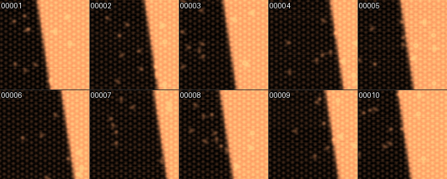
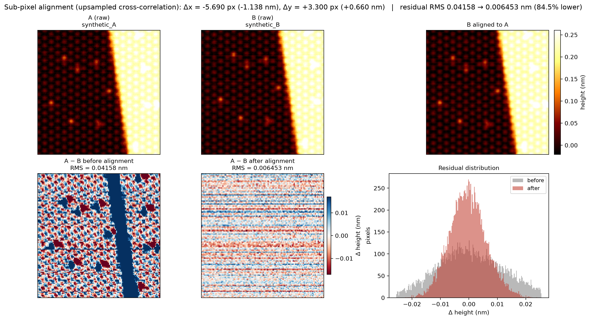

# Nanonis-RHK-SPM-PyTools

[](https://github.com/HamsterPark/Nanonis-RHK-SPM-PyTools/actions/workflows/ci.yml)
[](LICENSE)
[](pyproject.toml)

Python tools for scanning-probe-microscopy (STM/AFM) data written by Nanonis (`.sxm`) and RHK
(`.sm4`) controllers: one-command preview mosaics of whole datasets, sub-pixel alignment and
difference maps of two scans of the same area, and automatic removal of unscanned solid borders
from exported images. The binary readers are self-contained (NumPy only), the code is an ordinary
pip-installable package (`spmtools`) with console scripts, and every module is tested against
synthetic files.

<p align="center">
  
</p>
<p align="center"><em><code>spm-preview</code> output for ten <strong>synthetic</strong> Z scans
(tile labels are the trailing digits of the file names). Generated by
<code>docs/make_figures.py</code>; no measurement data is included in this repository.</em></p>

<p align="center">
  
</p>
<p align="center"><em><code>spm-align-diff</code> overview for two <strong>synthetic</strong> frames
with a drift of 3.3 px / −5.7 px: raw frames, the aligned frame, the difference before and after
alignment, and the residual histograms.</em></p>

## Features

- **Readers, no third-party SPM library**: `spmtools.io.sxm` parses the Nanonis header and reads
  any channel/direction lazily; `spmtools.io.sm4` walks the RHK object tree with `struct` and
  decodes image pages into physical units.
- **Dataset previews** (`spm-preview`): every folder that contains scans gets one PNG mosaic per
  channel, with domain rules for what is worth looking at, optional row-normalised Z, a central
  copy of all mosaics with path-derived names, and folder-level multiprocessing.
- **Sub-pixel alignment** (`spm-align-diff`): upsampled cross-correlation
  (Guizar-Sicairos et al. 2008) via scikit-image, cubic-spline resampling, cropping to the common
  area, difference maps in both polarities, an overview figure and the difference array as `.npy`.
- **Border cropping** (`spm-crop-solid`): iterative block-wise detection of solid-colour regions
  that is robust to scale bars drawn on top of them; preserves alpha/palette/EXIF, has a dry run
  and an output-directory mode.
- **Engineering**: `src` layout, dataclass configuration objects, `logging` instead of prints,
  type hints, docstrings, `ruff`, a pytest suite built on synthetic `.sxm`/`.sm4` writers, and
  GitHub Actions CI on Python 3.10–3.13.

## Supported formats

| Format | Extension | Module | What is decoded |
| --- | --- | --- | --- |
| Nanonis scan | `.sxm` | `spmtools.io.sxm` | all header tags, pixel size, scan direction, every channel in `both`/`fwd`/`bwd` direction (big- or little-endian float32) |
| RHK SM4 | `.sm4` | `spmtools.io.sm4` | file/page object tree, page metadata (type, scan direction, scales, bias, current, angle), page strings (label, units), image pages as int32 or float32 with x/y flips and z scaling |
| Exported images | `.png .jpg .jpeg .tif .tiff .bmp .gif .webp` | `spmtools.crop` | rendered images only (animated files are skipped) |

## Install

Python 3.10 or newer. The base package needs `numpy`, `pillow` and `matplotlib`; the `align`
extra adds `scipy` and `scikit-image` for `spm-align-diff`.

```bash
pip install "nanonis-rhk-spm-pytools[align] @ git+https://github.com/HamsterPark/Nanonis-RHK-SPM-PyTools"
```

or from a clone:

```bash
git clone https://github.com/HamsterPark/Nanonis-RHK-SPM-PyTools
cd Nanonis-RHK-SPM-PyTools
pip install -e ".[align]"
```

## Quick start

```bash
# Mosaics for one folder of scans -> <folder>/PreviewPy/<channel>_01.png
spm-preview /data/spm/2026/03/14

# Whole dataset (any folder layout), 4 worker processes, plus a central copy of every mosaic
spm-preview /data/spm --recursive --workers 4 --collect-dir /data/spm_previews

# Align the Z channel of two scans and write A-B, B-A, an overview figure and the .npy array
spm-align-diff scan_0117.sxm scan_0118.sxm
spm-align-diff A.sxm B.sxm --channel "Freq Shift" --smooth-sigma 1 --outdir out

# Remove unscanned borders from exported PNG/JPEG images (dry run first)
spm-crop-solid ./exports --dry-run
spm-crop-solid ./exports --out-dir ./exports_cropped

# Reproducible random subset of a dataset for quick test runs
spm-sample --root /data/spm --out /data/spm_subset --folders 3 --files-per-folder 12 --seed 2025
```

The same functionality is available from Python:

```python
from spmtools.io.sxm import SxmFile
from spmtools.io.sm4 import Sm4File
from spmtools.align import align_and_diff

scan = SxmFile("scan_0117.sxm")
print([(ch.name, ch.unit, ch.direction) for ch in scan.channels])
z = scan.read("Z")  # (ny, nx) float32, top-left = top-left of the frame
df = scan.read("Freq Shift", "forward")  # substring lookup

sm4 = Sm4File("image.sm4")
page = sm4.first_topography()  # first forward topography page
topo = sm4.read_image(page)  # (y, x) float64 in the page's z unit

result = align_and_diff(z, SxmFile("scan_0118.sxm").read("Z"))
print(result.shift, result.rms_before, result.rms_after)
```

## How it works

### Nanonis `.sxm`

The file is an ASCII header of `:TAG:` blocks terminated by `:SCANIT_END:`, a `\x1a\x04` marker
and a block of float32 images. `:DATA_INFO:` lists the channels with their direction; a `both`
channel stores its forward image followed by the backward one, so the reader computes the image
offset from the directions of all preceding channels rather than assuming two images per
channel. Backward images are stored right-to-left and `up` scans bottom-up; `SxmFile.read()`
undoes both by default so that `array[0, 0]` is always the top-left corner of the frame.

### RHK `.sm4`

An SM4 file is a tree of `(type, offset, size)` object triples: file header → page index header
→ page index array → per-page header and data objects. The reader unpacks every structure with
explicit little-endian `struct` layouts, checks the `STiMage` signature, reads the page string
table (label, units) and decodes image pages row-major as `(y_size, x_size)`, flipping for
negative `x_scale` / positive `y_scale` and applying `z = raw * z_scale + z_offset`. The layout
was cross-checked against Gwyddion's `rhk-sm4.c` and the `spym` reader.

### Preview mosaics

Each scan becomes one tile: the image is clipped to the 1st–99th percentile (configurable),
colour-mapped (fixed maps for Z, Z_line, Current and frequency shift; a stable hash-based
choice for anything else), resized to the tile size and labelled with the trailing digits of the
file name. Tiles are packed into `cols`-wide mosaics of at most `max-tiles` tiles per PNG.
The channel policy for `.sxm` files: backward-only channels and housekeeping channels (Bias, X, Y,
oscillation-controller phase/amplitude/excitation, lock-in demodulators) are skipped; Z is shown
raw and after row-median subtraction (`Z_line`); Current is kept only for nc-AFM scans (a
frequency-shift channel with signal) or when there is no usable Z; constant/all-zero channels are
dropped. For `.sm4` files the first forward topography page is rendered as Z and Z_line.
With `--workers N`, folders are processed in parallel with `ProcessPoolExecutor`.

### Sub-pixel alignment

Both images are cleaned (non-finite pixels filled), de-meaned and Hann-windowed, then the
translation is estimated by upsampled cross-correlation
(`skimage.registration.phase_cross_correlation`, default 1/100 px) with `normalization=None`.
Plain cross-correlation is used on purpose: the spectral whitening of phase correlation locks onto
the line noise and periodic streaks that are common in SPM images and then reports spurious shifts
of tens of pixels. Because the window biases a single estimate towards zero by a few percent,
the estimate is refined twice: the second image is resampled with the current shift, both images
are cropped to their common area and correlated again (on synthetic scans this brings the error
below 0.05 px). Finally the second image is resampled onto the first grid with a cubic spline,
the extrapolated margin is masked out with a shifted all-ones image, and everything is cropped to
the common rectangle before the difference maps, RMS statistics and figures are produced. The
scale bar length is chosen automatically (1-2-5 series, about a quarter of the field of view).

### Border cropping

For every row and column the median colour is computed together with the fraction of pixels
within `--tolerance` of it; lines above 85 % are *solid*. From each edge, blocks of
`--block-size` lines are removed while at least 60 % of the block is solid, which keeps a thin
scale-bar line inside the border from stopping the scan. Crops thinner than `--min-crop` of the
dimension are ignored and crops of 90 % or more are rejected as false positives. The pass is
repeated up to three times because removing a top/bottom border can expose a left/right border
that was previously "diluted" by the corner region.

## Command reference

| `spm-preview` | |
| --- | --- |
| `ROOT` | folder with scans, or a dataset root with `--recursive` (any folder layout) |
| `--workers N` | worker processes, one folder each (`0` = up to 4) |
| `--collect-dir DIR` | copy every mosaic to `DIR/<relative_path>__<mosaic>.png` |
| `--sm4-collect-dir DIR` | folder for SM4 topography mosaics (default `SM4_PreviewPy`, only created when `.sm4` files exist; `""` disables) |
| `--tile-size`, `--max-tiles`, `--cols` | tile pixels (256), tiles per mosaic (25), columns (5, `0` = auto) |
| `--percentiles LO,HI` | display clipping (`1,99`) |
| `--keep-constant`, `--const-tol`, `--zero-tol` | control the constant/all-zero channel filter |
| `--limit N`, `--label-digits N`, `--no-label`, `--no-progress`, `--verbose` | |

| `spm-align-diff` | |
| --- | --- |
| `A B` | two `.sxm` files (default: the two `.sxm` files in the current directory) |
| `--channel NAME` | exact name first, then substring match (default `Z`) |
| `--direction forward\|backward`, `--upsample N` | scan direction, sub-pixel factor (100) |
| `--cmap`, `--clip`, `--smooth-sigma`, `--outdir` | colormap (`RdBu`), colour-scale percentile (99), Gaussian smoothing in px (0), output folder |

| `spm-crop-solid` | |
| --- | --- |
| `IMAGE_DIR` | searched recursively |
| `--dry-run` | report crops, write nothing |
| `--out-dir DIR` | write cropped copies (mirroring the tree) instead of replacing files |
| `--tolerance`, `--min-crop`, `--block-size`, `--row-thresh`, `--block-thresh` | detection thresholds (15, 0.08, 20, 0.85, 0.6) |
| `--jpeg-quality N` | quality for re-encoded JPEGs (95); EXIF and ICC profiles are kept |

| `spm-sample` | |
| --- | --- |
| `--root R --out O` | dataset root and destination (folder structure is mirrored) |
| `--folders N`, `--files-per-folder N`, `--seed S` | how many data folders and files per folder to draw (3, 12, 2025) |
| `--extensions sxm,sm4`, `--manifest NAME` | file types to include; UTF-8 list of copied files written into `O` |

All commands accept `--verbose` and `--version`.

## Development

```bash
git clone https://github.com/HamsterPark/Nanonis-RHK-SPM-PyTools
cd Nanonis-RHK-SPM-PyTools
python -m venv .venv && . .venv/bin/activate    # Windows: .venv\Scripts\activate
pip install -e ".[dev]"
ruff check . && ruff format --check .
pytest
python docs/make_figures.py   # regenerate the README figures from synthetic data
```

Layout: `src/spmtools/io/` (readers), `preview.py`, `align.py`, `crop.py`, `dataset.py`
(folder discovery and sampling), `cli.py` (argument parsing only). `tests/conftest.py` contains
independent writers for synthetic `.sxm` and `.sm4` files that the tests use instead of
measurement data.

## Migrating from the standalone scripts

| Before (scripts in the repository root) | Now |
| --- | --- |
| `py -3 sxm_preview.py ROOT --recursive` | `spm-preview ROOT --recursive` |
| `py -3 sxm_preview_parallel.py ROOT --recursive --workers 4` | `spm-preview ROOT --recursive --workers 4` |
| `py -3 align_sxm_diff.py A.sxm B.sxm` | `spm-align-diff A.sxm B.sxm` |
| `py -3 crop_solid.py DIR` | `spm-crop-solid DIR` |
| `py -3 make_test_subset.py --root R --out O --days 3` | `spm-sample --root R --out O --folders 3` |

Behaviour changes: `--recursive` now handles any folder layout (the old year/month/day
assumption and a lab-specific folder exception are gone); unreadable files are reported as
warnings by default; `spm-align-diff` without arguments looks in the current directory instead
of next to the script and labels its figures in English; the SM4 collect folder is only created
when the dataset contains `.sm4` files; `spm-crop-solid` keeps alpha channels, palettes and EXIF
data and skips animated images.

If `import numpy` hangs on a Windows machine with a broken WMI service, set
`SPMTOOLS_DISABLE_WMI=1` before running any of the commands.

## Limitations

- SM4: only image pages are decoded (spectroscopy pages are listed, not read) and the preview
  renders only the first topography page. The reader was validated on synthetic files and
  cross-checked against Gwyddion/spym, not on a large corpus of instrument files.
- SXM: only the `FLOAT` sample type (the only one Nanonis writes) is supported.
- Alignment assumes a pure translation on the same pixel grid: no rotation, scaling or
  in-scan drift correction, and both scans must have the same pixel count.
- Border cropping operates on rendered images; borders that do not reach the image edge are not
  detected.

## License

MIT, see [LICENSE](LICENSE).
